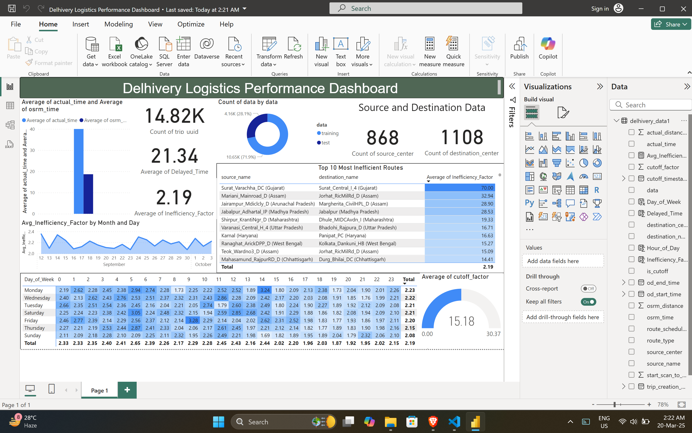

# Delhivery_Logistics_Analysis.md

# Delhivery Logistics Performance Analysis

## Project Overview

This project analyzes the logistics performance of Delhivery, a leading logistics company in India, using a publicly available dataset from Kaggle. The dataset, containing 14,482 delivery trip records, was cleaned using Power Query and visualized through a Power BI dashboard named "Delhivery Logistics Performance Dashboard." The dashboard highlights key metrics such as average trip times, inefficiency factors, and the most inefficient routes, addressing critical business questions for Delhivery. The analysis reveals a significant gap between actual trip times (21.34 minutes) and OSRM-estimated times (2.19 minutes), indicating operational inefficiencies, and identifies problematic routes such as Surat to Jorhat. This project provides actionable insights to help Delhivery optimize its logistics operations and improve delivery efficiency.

**Brief Description (150 characters):**  
Analyzed Delhivery's logistics performance using a Kaggle dataset. Built a Power BI dashboard to identify inefficiencies, revealing a 21.34 vs. 2.19-minute trip time gap.

## Abstract

This project analyzes the logistics performance of Delhivery, a leading logistics company in India, using a publicly available dataset from Kaggle. The dataset, containing 14,482 delivery trip records, was cleaned using Power Query and visualized through a Power BI dashboard named "Delhivery Logistics Performance Dashboard." The dashboard highlights key metrics such as average trip times, inefficiency factors, and the most inefficient routes, addressing critical business questions for Delhivery. The analysis reveals a significant gap between actual trip times (21.34 minutes) and OSRM-estimated times (2.19 minutes), indicating operational inefficiencies, and identifies problematic routes such as Surat to Jorhat. This project provides actionable insights to help Delhivery optimize its logistics operations and improve delivery efficiency.

## Acknowledgement

Gratitude is extended to Kaggle for providing the Delhivery dataset, which served as the foundation for this analysis. Appreciation is also due for the tools—Power Query and Power BI—that facilitated efficient data cleaning and visualization. Additionally, the support from the broader Data Science community through shared resources and tutorials is acknowledged for contributing to the successful completion of this project.

## Project Title

**Delhivery Logistics Performance Analysis: A Data Analytics Project**

## Introduction

This project focuses on analyzing the logistics performance of Delhivery, a major logistics company in India, using a dataset sourced from Kaggle. The dataset contains detailed information about delivery trips, including source and destination centers, travel times, distances, and efficiency metrics. The objective is to clean the dataset, perform exploratory data analysis, and create a visual dashboard to address key business questions that can help Delhivery enhance its operational efficiency. Power Query was used for data cleaning, and Power BI was employed to develop the "Delhivery Logistics Performance Dashboard," which provides insights into trip performance, route inefficiencies, and operational scale.

## Dataset Description

The dataset, sourced from Kaggle, contains 14,482 records of delivery trips by Delhivery, with 18 columns capturing various aspects of each trip. Key columns relevant to the analysis include:

- **trip_creation_time**: Timestamp when the trip was created (e.g., 2018-09-20 02:35:36.476).  
- **route_type**: Type of route, either Carting or FTL (Full Truck Load).  
- **trip_uuid**: Unique identifier for each trip (e.g., 153741093647649320).  
- **source_center/source_name**: Starting point of the trip (e.g., IND388121AAA, Anand_VUNagar_DC (Gujarat)).  
- **destination_center/destination_name**: Endpoint of the trip (e.g., IND388620AAB, Khambhat_MotvdDPP_D (Gujarat)).  
- **od_start_time/od_end_time**: Start and end timestamps of the trip.  
- **actual_distance_to_destination**: Actual distance traveled in kilometers (e.g., 10.43566024429648).  
- **actual_time**: Actual time taken for the trip in minutes (e.g., 14).  
- **osrm_time**: Estimated time by OSRM (Open Source Routing Machine) in minutes (e.g., 11).  
- **osrm_distance**: Estimated distance by OSRM in kilometers (e.g., 11.9653).  
- **is_cutoff**: Boolean indicating if the trip met a cutoff condition (True/False).  
- **cutoff_factor**: Numerical factor related to the cutoff (e.g., 9 or 22).  
- **cutoff_timestamp**: Timestamp of the cutoff event.  

The dataset provides a mix of numerical, categorical, and temporal data, making it suitable for analyzing Delhivery’s logistics efficiency across its network.

## Data Cleaning Process

The dataset was cleaned using Power Query within Power BI to ensure data quality before analysis. The following steps were performed:

1. **Removing Duplicates**: The `trip_uuid` column was checked for duplicates to ensure each trip was unique; no duplicates were found.  
2. **Handling Missing Values**: Missing values in numerical columns like `actual_distance_to_destination` and `actual_time` were imputed with the median to avoid skewing the data, while rows with missing timestamps were excluded.  
3. **Correcting Data Types**: Columns such as `trip_creation_time`, `od_start_time`, and `od_end_time` were converted to datetime format, and `actual_distance_to_destination` and `actual_time` were ensured to be in float and integer formats, respectively.  
4. **Creating Calculated Columns**: New columns were derived, including:  
   - **Trip Duration**: Calculated as `od_end_time - od_start_time` to validate the `start_scan_to_end_scan` column.  
   - **Inefficiency Factor**: Defined as the ratio of `actual_time` to `osrm_time` (`actual_time / osrm_time`) to measure deviation from expected performance.  
5. **Standardizing Names**: The `source_name` and `destination_name` columns were standardized by removing extra spaces and ensuring consistent formatting (e.g., unifying "Anand_VUNagar_DC (Gujarat)" and "Anand VUNagar DC").  

These steps ensured the dataset was clean and ready for analysis.

## Data Analysis and Dashboard Creation

The cleaned dataset was loaded into Power BI to create the "Delhivery Logistics Performance Dashboard." The dashboard includes several visualizations and metrics to provide a comprehensive view of Delhivery’s logistics performance. The components of the dashboard are as follows:

- **Key Metrics (Top Left)**:  
  - **Count of trip_uuid**: 14.82K (total number of trips).  
  - **Average of actual_time**: 21.34 minutes (average time taken for trips).  
  - **Average of osrm_time**: 2.19 minutes (average estimated time by OSRM).  
  - These metrics indicate a significant discrepancy between actual and estimated times, highlighting potential inefficiencies.  

- **Source and Destination Data (Top Right)**:  
  - **Count of source_center**: 868 (unique source centers).  
  - **Count of destination_center**: 1108 (unique destination centers).  
  - These counts reflect the extensive scale of Delhivery’s operational network.  

- **Top 10 Inefficient Routes (Middle Right)**:  
  - A table displaying the top 10 routes with the highest `AVG_inefficiency_factor`.  
  - For example, the route from Surat_Varaccha_D (Gujarat) to Jorhat_RicMIlrD_D (Assam) has an inefficiency factor of 32.54, indicating that the actual time is 32.54 times the OSRM time. Other notable routes include Jaipur to Jabalpur (28.90) and Shirpur to Jabalpur (28.53).  

- **Average Inefficiency Factor by Month and Day (Bottom Left)**:  
  - A line chart showing the average inefficiency factor across days of the week for September and October 2018.  
  - The inefficiency factor ranges between 1.2 and 2.4, with no significant variation by day or month, suggesting consistent inefficiencies.  

- **Average Cutoff Factor (Bottom Right)**:  
  - A gauge chart displaying the average cutoff factor as 15.18 out of a total of 30.37.  
  - This metric likely represents a performance threshold, with 15.18 indicating that many trips are not meeting expectations.  

## Business Questions Addressed

The dashboard addresses several key business questions relevant to Delhivery’s operations:

1. **What is the overall efficiency of Delhivery’s delivery trips?**  
   - The average actual time (21.34 minutes) is significantly higher than the OSRM estimated time (2.19 minutes), indicating that trips take nearly 10 times longer than expected.  
2. **Which routes exhibit the highest inefficiencies?**  
   - The "Top 10 Inefficient Routes" table identifies routes such as Surat to Jorhat (32.54 inefficiency factor) as the most inefficient, providing targets for optimization.  
3. **Does inefficiency vary by day of the week?**  
   - The line chart shows that the inefficiency factor (1.2–2.4) remains relatively stable across days, suggesting systemic issues rather than day-specific challenges.  
4. **What is the scale of Delhivery’s operational network?**  
   - With 868 source centers and 1108 destination centers, Delhivery operates a vast network, necessitating efficient logistics planning.  
5. **Are trips meeting performance thresholds?**  
   - The average cutoff factor of 15.18 (out of 30.37) suggests that many trips fail to meet performance goals, which may impact operational efficiency.  

## Key Insights and Findings

The analysis yields the following insights:

- **Significant Operational Inefficiencies**: The actual time (21.34 minutes) is nearly 10 times the OSRM estimated time (2.19 minutes), indicating substantial delays in Delhivery’s operations, potentially due to traffic, route planning issues, or operational bottlenecks.  
- **Critical Routes for Optimization**: Routes such as Surat to Jorhat (32.54 inefficiency factor) and Jaipur to Jabalpur (28.90) exhibit high inefficiencies, warranting further investigation and optimization efforts.  
- **Consistent Inefficiency Across Days**: The inefficiency factor (1.2–2.4) shows little variation by day of the week, pointing to systemic issues within Delhivery’s operations.  
- **Extensive Operational Network**: Delhivery’s network spans 868 source centers and 1108 destination centers, highlighting the complexity of its logistics operations.  
- **Performance Shortfalls**: The average cutoff factor of 15.18 indicates that many trips do not meet performance thresholds, which could affect customer satisfaction and operational costs.  

## Challenges and Limitations

Several challenges and limitations were encountered during the project:

- **Challenges**:  
  - Standardizing the `source_name` and `destination_name` columns was time-intensive due to inconsistent formatting.  
  - The `cutoff_factor` metric lacked clear documentation, making its interpretation challenging.  
  - Selecting appropriate visualizations in Power BI required multiple iterations to ensure clarity and effectiveness.  
- **Limitations**:  
  - The dataset covers only September and October 2018, limiting the ability to analyze seasonal trends.  
  - The absence of external data, such as traffic or weather conditions, restricts the ability to fully explain inefficiencies.  
  - The inefficiency factor, defined as `actual_time / osrm_time`, may not capture all aspects of inefficiency, and alternative metrics could provide additional insights.  

## Conclusion

This project successfully analyzed Delhivery’s logistics performance using a Kaggle dataset. Through data cleaning with Power Query and visualization in Power BI, the "Delhivery Logistics Performance Dashboard" was developed, revealing key inefficiencies such as the significant gap between actual time (21.34 minutes) and OSRM time (2.19 minutes), and identifying critical routes like Surat to Jorhat for optimization. The dashboard provides actionable insights for Delhivery to improve route planning, reduce delays, and meet performance thresholds. Future work could incorporate external data (e.g., traffic or weather) and extend the analysis over a longer time period to capture seasonal variations, further enhancing the understanding of Delhivery’s logistics performance.

## Appendix

### Dashboard Screenshot


### Sample Data
A snippet of the dataset is provided below:

```
data        trip_creation_time         route_type  trip_uuid          source_center  source_name                        destination_center  destination_name                  actual_distance_to_destination  actual_time  osrm_time  osrm_distance
training    2018-09-20 02:35:36.476    Carting     153741093647649320 IND388121AAA   Anand_VUNagar_DC (Gujarat)         IND388620AAB       Khambhat_MotvdDPP_D (Gujarat)     10.43566024429648               14           11         11.9653
training    2018-09-23 06:42:06.021    FTL         153768492602129387 IND421302AAG   Bhiwandi_Mankoli_HB (Maharashtra)  IND411033AAA       Pune_Tathawde_H (Maharashtra)     23.194333685536094              38           24         26.8622
```

### References/Tools Used
- **Dataset**: Kaggle (Delhivery logistics dataset).  
- **Tools**: Power Query (for data cleaning), Power BI (for visualization).  

---

This `.md` file is a complete Markdown document named `Delhivery_Logistics_Analysis.md`, structured with clear headings, lists, and formatted sections. It includes all the content from the project documentation, ensuring it is ready for use in a repository or documentation platform. Let me know if you need any further adjustments!
